# TrustChain (SIH26125) 🛡️
### Decentralized Identity, RBAC & Digital Asset Trust Platform
**Smart India Hackathon (SIH 2026)**

[](https://soliditylang.org/)
[](https://getfoundry.sh/)
[](https://www.rust-lang.org/)
[](https://react.dev/)
[](https://sepolia.etherscan.io/)

---

## 📌 Problem Statement Overview
Organizations today rely heavily on centralized identity and access management systems, creating critical vulnerabilities like single points of failure, data breaches, identity theft, and untraceable digital asset ownership.

**TrustChain** solves this by delivering a unified, tamper-proof blockchain framework integrating:
1. **Self-Sovereign Decentralized Identifiers (W3C DIDs)** with 2-Step Wallet-Signed Controller Rotation (`proposeController` & `acceptController`).
2. **On-Chain Role-Based Access Control (RBAC)** (`isAdmin`, `isManager`, `isAuditor`, `isUser`) enforced in Solidity.
3. **ERC-721 Verifiable Digital Asset NFTs** with anchored Keccak-256 hashes.
4. **High-Performance Rust + Axum Event Indexer & Cryptographic Engine**.
5. **Gasless Verifiable Presentations (VPs)** with EIP-191 cryptographic signatures & short link generation.
6. **Zero-Authentication Public Camera QR Verification** & 6-point proof validation.

---

## 📊 System Architecture & Data Flow

```mermaid
flowchart TD
    %% ── Style Definitions ──
    classDef actorStyle fill:#1e293b,color:#fff,stroke:#475569,stroke-width:2px;
    classDef contractStyle fill:#059669,color:#fff,stroke:#047857,stroke-width:2px;
    classDef backendStyle fill:#4f46e5,color:#fff,stroke:#3730a3,stroke-width:2px;
    classDef frontendStyle fill:#0284c7,color:#fff,stroke:#0369a1,stroke-width:2px;
    classDef outputStyle fill:#d97706,color:#fff,stroke:#b45309,stroke-width:2px;

    %% ── Actors ──
    Admin["👨💼 Admin / Issuer"]:::actorStyle
    Holder["👤 Credential Holder"]:::actorStyle
    Verifier["🔍 Public Verifier"]:::actorStyle

    %% ── Off-Chain Systems ──
    MetaMask["🦊 Web3 Wallet (MetaMask)"]:::actorStyle
    IPFS["📦 IPFS (Metadata Storage)"]:::backendStyle
    Backend["⚡ Rust Backend & Indexer"]:::backendStyle
    VP["📄 Verifiable Presentation & QR Code"]:::frontendStyle
    Scanner["📷 Camera QR Scanner"]:::frontendStyle

    %% ── All Smart Contracts & Their Specific Roles ──
    subgraph Contracts["⛓️ Ethereum Sepolia Smart Contracts"]
        RoleMgr["🔒 RoleManager.sol\n(Role-Based Access Control)"]:::contractStyle
        IdentityReg["🪪 IdentityRegistry.sol\n(W3C DID Management)"]:::contractStyle
        SchemaReg["📜 SchemaRegistry.sol\n(Credential Standards)"]:::contractStyle
        AssetNFT["💎 AssetNFT.sol\n(ERC-721 Credential Minting)"]:::contractStyle
        AssetReg["🛡️ AssetRegistry.sol\n(On-Chain Validity & Revocation)"]:::contractStyle
    end

    %% ── Outputs ──
    VerifyResult["✅ 6/6 Verification Result Card"]:::outputStyle
    AuditDash["📊 Real-Time Audit Dashboard"]:::outputStyle

    %% ── STEP 1: IDENTITY & ACCESS CONTROL ──
    Holder -->|Step 1.1: Web3 Connect & Challenge Sign| MetaMask
    MetaMask -->|Step 1.2: Check Roles| RoleMgr
    MetaMask -->|Step 1.3: Register Self-Sovereign Identity| IdentityReg

    %% ── STEP 2: SCHEMA & ASSET MINTING ──
    Admin -->|Step 2.1: Register Credential Standard| SchemaReg
    Admin -->|Step 2.2: Upload Asset Metadata Payload| IPFS
    Admin -->|Step 2.3: Mint ERC-721 Credential NFT| AssetNFT
    AssetNFT -->|Step 2.4: Link NFT Ownership to DID| IdentityReg
    AssetNFT -->|Step 2.5: Register Active Asset Status| AssetReg

    %% ── STEP 3: VERIFIABLE PRESENTATION & QR GENERATION ──
    Holder -->|Step 3.1: Select Asset & Set Expiry| VP
    VP -->|Step 3.2: Cryptographic Message Sign| MetaMask
    VP -->|Step 3.3: Generate Short Link & Downloadable QR| Backend

    %% ── STEP 4: VERIFICATION & CAMERA SCAN ──
    Verifier -->|Step 4.1: Point Camera at QR Code| Scanner
    Scanner -->|Step 4.2: Resolve VP Payload| Backend
    Backend -->|Step 4.3: Validate On-Chain Status & Revocation| AssetReg
    Backend -->|Step 4.4: Display Complete Integrity Proof| VerifyResult

    %% ── STEP 5: IMMUTABLE AUDIT TRAIL ──
    AssetNFT -.->|Step 5.1: Emit Smart Contract Events| Backend
    Backend -.->|Step 5.2: Sync Logs to Audit Stream| AuditDash
```



---

## 🚀 Quick Start (Local Setup)

### Prerequisites
- Node.js (v18+)
- Rust / Cargo (`1.75+`)
- PostgreSQL database (`trustchain`)
- Foundry (`forge` for smart contract testing)

### 1. Launch Frontend Application
```bash
cd frontend
npm install
npm run dev
```
*Frontend runs on `http://localhost:5173` with RainbowKit / Wagmi connection.*

### 2. Launch Backend & Indexer
```bash
cd backend
cargo run
```
*Axum REST API server starts on `http://localhost:3001` and connects to Sepolia RPC.*

### 3. Smart Contracts (Foundry)
```bash
cd contracts
forge test -vvv
```
*Runs complete security test suite against Sepolia contracts.*

---

## 🏛️ Repository Structure

```
SIH2026/
├── contracts/                     # Solidity 0.8.24 smart contracts & Foundry tests
│   ├── src/
│   │   ├── IdentityRegistry.sol   # W3C DID management, controllers & 2-step rotation
│   │   ├── RoleManager.sol        # Admin, Manager, Auditor, User on-chain RBAC
│   │   ├── SchemaRegistry.sol     # W3C schema definitions & hash anchoring
│   │   ├── AssetNFT.sol           # ERC-721 Unique Digital Asset NFT minting
│   │   ├── AssetRegistry.sol      # Core asset lifecycle, status & revocation
│   │   └── AccountAbstraction/
│   │       ├── TrustSmartAccount.sol # ERC-4337 Smart Account
│   │       └── TrustPaymaster.sol    # Gas-sponsorship Paymaster
│   └── test/                      # Passing Foundry security test matrix
│
├── backend/                       # High-Performance Rust Axum backend & Sepolia indexer
│   ├── src/
│   │   ├── blockchain/            # Alloy RPC client & contract call interfaces
│   │   ├── db/                    # SQLx PostgreSQL pool & queries
│   │   ├── routes/                # Auth, Identity, Schemas, Assets, VP, Write, Audit
│   │   └── indexer.rs             # Background Sepolia event listener
│   └── Cargo.toml
│
├── frontend/                      # Modern React + TypeScript + Vite Web Application
│   ├── src/
│   │   ├── components/            # Navbar, layout & reusable UI cards
│   │   ├── context/               # AuthContext (Wagmi + RainbowKit authentication)
│   │   ├── pages/                 # Home, Identity, Assets, Schemas, Share, Verify, Audit, Dashboard
│   │   └── services/              # Web3 auth & backend API service layer
│   └── package.json
│
└── docs/                          # Architecture specs, Threat Model, Demo Guides
```

---

## 🔒 Security Test Matrix

| Security Test Case | Expected Behavior | Status |
| :--- | :--- | :--- |
| Non-admin attempts to grant role | Transaction Reverts | ✅ PASS |
| Non-manager attempts to mint asset | Transaction Reverts | ✅ PASS |
| Tampered credential JSON payload | Hash mismatch -> INVALID | ✅ PASS |
| Unknown / Unregistered schema | Transaction Reverts | ✅ PASS |
| Action against revoked DID | Action Rejected | ✅ PASS |
| Verifying revoked asset | Status = REVOKED | ✅ PASS |
| Verifying expired credential | Status = EXPIRED | ✅ PASS |
| Transferring non-transferable soulbound | Transaction Reverts | ✅ PASS |
| Unauthorized controller rotation | Transaction Reverts | ✅ PASS |
| Duplicate DID registration attempt | Transaction Reverts | ✅ PASS |

---

## 👥 Team
- **Blockchain / Web3**: Smart Contracts, ERC-721, RBAC, DID Registry, Account Abstraction
- **Backend / Systems**: Rust Axum, Alloy, Indexer, PostgreSQL, Cryptographic Verifier
- **Frontend / UX**: React, TypeScript, Vite, RainbowKit, QR Verification
- **Security / Architecture**: Threat Modeling, STRIDE analysis, Security Test Matrix
